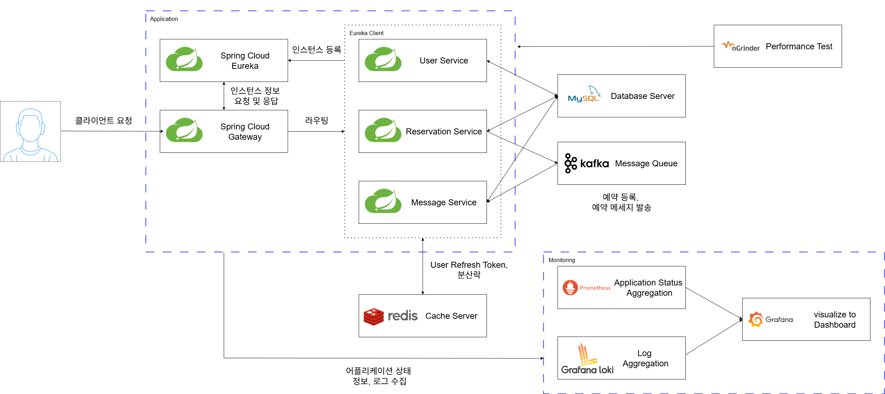

# Waiting Friends

## 📌 프로젝트 소개

'웨이팅 프렌즈'는 웨이팅 관리 시스템으로 고객은 회원가입 없이 매장에 줄을 서고, 점주는 이를 쉽게 관리할 수 있도록 도와주는 서비스 입니다.

## 📌 구현 기능
- 고객
  - 웨이팅 등록 및 취소
  - 웨이팅 실시간 현황 조회
- 점주
  - 회원가입 및 로그인, 로그아웃
  - 매장 등록 및 관리
  - 웨이팅 실시간 목록 조회
  - 웨이팅 상태 변경 및 호출

## 📌 기술 스택
- `java 17`
- `Spring Boot`, `Spring Cloud`
- `Spring Security`, `JWT`
- `Spring Data JPA`
- `MySQL`, `Redis`
- `Kafka`, `Zookeeper`
- `Docker`
- `Prometheus`, `Grafana`, `Loki`
- `ngrinder`

## 📌 아키텍처

## 📌 기술적 고민과 해결
- 동시성 제어
  - [낙관적 락과 비관적 락을 사용하여 예약 기능 동시성 처리하기](https://cjsrhd94.tistory.com/213)
  - [Redisson 분산락을 사용하여 예약 기능 동시성 처리하기](https://cjsrhd94.tistory.com/215)
- 성능 최적화
  - [1000만건의 데이터를 커버링 인덱스를 사용하여 쿼리 최적화하기](https://cjsrhd94.tistory.com/223)
  - [Spring JDBC Batch Insert를 사용해 대용량 데이터 삽입시 성능 최적화](https://cjsrhd94.tistory.com/219)
  - [nGrinder 부하 테스트를 활용하여 Hikari CP 최적화하기](https://cjsrhd94.tistory.com/221)
- 모니터링
  - [prometheus와 grafana를 사용해 서버 모니터링 환경 구축](https://cjsrhd94.tistory.com/216)
  - [loki와 grafana를 사용해 로그 모니터링 환경 구축](https://cjsrhd94.tistory.com/217)